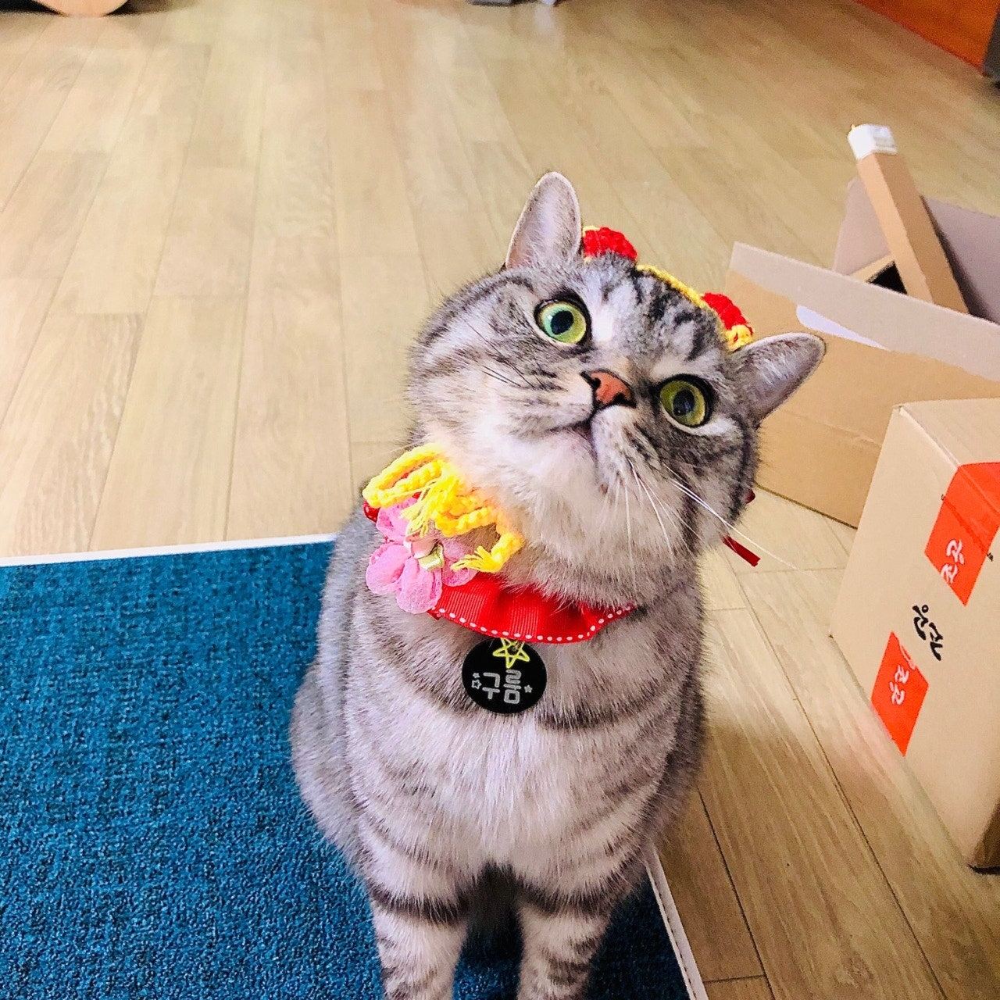

개인프로필  
=============

{: width="100%" height="100%"}
정다희  
-------------
내 홈페이지: <https://github.com/clouari/firstRepository>

이메일주소 : <ekdudekgml35@naver.com>

내 블로그 
<https://www.notion.so/Mainspace-2883683f58984f99bf25d2acb1da8418>
<https://blog.naver.com/ekdudekgml35>

1. 내가 배운 기술들 

2. 내가 배울 기술들 

3. 내가 만들어본 프로젝트
4. 내가 참여한 프로젝트
5. 목표로 하는 프로젝트

자기소개
